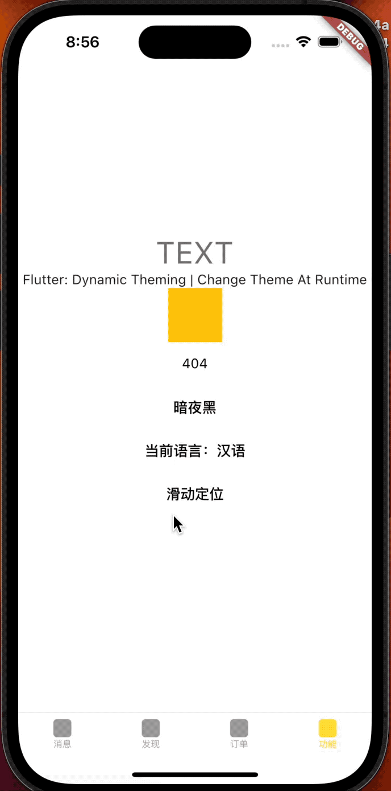

# Dynamic Theme 支持多语言切换（Flutter 3.10.x,Java 11）

## 运行版本flutter3.10.x
```bash
Flutter 3.10.6 • channel stable • https://github.com/flutter/flutter.git
Framework • revision f468f3366c (9 months ago) • 2023-07-12 15:19:05 -0700
Engine • revision cdbeda788a
Tools • Dart 3.0.6 • DevTools 2.23.1
```

## Java 版本
```bash
openjdk version "11.0.22" 2024-01-16 LTS
OpenJDK Runtime Environment Zulu11.70+15-CA (build 11.0.22+7-LTS)
OpenJDK 64-Bit Server VM Zulu11.70+15-CA (build 11.0.22+7-LTS, mixed mode)
```

## 打包arm64,arm
```bash
flutter build apk --release --target-platform android-arm64,android-arm
```

## Android版本下载（iOS下载代码打包📦）
<p align="center">
    
</p>


## 暗黑模式&亮白模式

<p align="center">
    
</p>


<p align="center">
    
    
    
    
    
    
    
    
    
    
</p>

## 滑动定位
<p align="center">
    
</p>


## Flutter version

```bash
Flutter 2.2.3 • channel stable • https://github.com/flutter/flutter.git
Framework • revision f4abaa0735 (2 weeks ago) • 2021-07-01 12:46:11 -0700
Engine • revision 241c87ad80
Tools • Dart 2.13.4
```

## Flutter 集成测试

```bash
flutter drive --target=test_driver/app.dart
```

## Flutter 打包

```bash
flutter build apk --release
```

## Flutter 性能调试

```bash
flutter run --profile --trace-skia
flutter screenshot --type=skia --observatory-uri=http://127.0.0.1:49368/s4vbW7Mp_KE=/#/timeline
```

## 监听路由变化，返回进入（pop.then不能监听iOS侧滑或Android侧滑以及物理键返回的回调）

`Flutter` 中，`RouteAware` 是一个 `widget mixin`，用于监听路由的推送和弹出事件。这使得 widget 能够知道它们何时被显示或隐藏，例如当用户导航到一个页面或从一个页面返回时。这对于跟踪页面视图或执行在页面进入或离开屏幕时的操作特别有用。

RouteAware 需要和 RouteObserver 一起使用，后者是一个监听 Navigator 路由堆栈变化的类。你需要在全局范围内创建一个 RouteObserver 并在整个应用中使用它，这样 `RouteAware mixin` 的 widgets 才能注册到观察者并接收路由变化的通知。

```dart
class _NewViewState extends State<NewView> with RouteAware {
  @override
  void didChangeDependencies() {
    super.didChangeDependencies();
    App.routeObserver.subscribe(this, ModalRoute.of(context) as PageRoute<dynamic>);
    debugPrint("$this");
  }

  @override
  void didPopNext() {
    // Covering route was popped off the navigator.
    debugPrint('返回NewView');
  }

  @override
  void didPush() {
    // Route was pushed onto navigator and is now topmost route.
    debugPrint('进入NewView');
  }

  @override
  void dispose() {
    App.routeObserver.unsubscribe(this);
    super.dispose();
  }
}
```

## 路由(命名路由)

### Navigator.of(context).pushNamed
> Navigator.of(context).pushNamed 直接进入新页面(每次都将新建一个新的页面)

### Navigator.of(context).pushReplacementNamed
> `Navigator.of(context).pushReplacementNamed` 把当前页面在栈中的位置替换成跳转的页面（替换导航器的当前路由，通过推送路由[routeName]），当新的页面进入后，之前的页面将执行dispose方法

### Navigator.of(context).popAndPushNamed
> `Navigator.of(context).popAndPushNamed` 将当前页面pop，然后跳转到制定页面（将当前路由弹出导航器，并将命名路由推到它的位置

### Navigator.of(context).pushNamedAndRemoveUntil
> `Navigator.of(context).pushNamedAndRemoveUntil` 将制定的页面加入到路由中，然后将其他所有的页面全部pop, (Route route) => false将确保删除推送路线之前的所有路线。 这时候将打开一个新页面

> 例如 当用户点击了退出登录时，我们需要进入某一个页面（比如点退出登录后进入了登录页），这个时候用户点击返回时不应该能进入任何一个页面，这种情况就可以使用

```dart
Navigator.of(context).pushNamedAndRemoveUntil('/', (Route<dynamic> route) => false);
```

### Navigator.of(context).pushNamedAndRemoveUntil
> `Navigator.of(context).pushNamedAndRemoveUntil` 将指定的页面加入到路由中，然后将之前的路径移除直到指定的页面为止（将具有给定名称的路由推到导航器上，然后删除所有路径前面的路由直到'predicate'返回true为止。）
这时候将销毁栈内除了screen4的页面，点击直接去栈内screen4，这时screen4会重新build

```dart
Navigator.of(context).pushNamedAndRemoveUntil('/screen4', ModalRoute.withName('/screen1'));
```

### Navigator.of(context).popUntil
`Navigator.of(context).popUntil`推出之前push的路由直到`/newView`路由为止

```
Navigator.of(context).popUntil(ModalRoute.withName('/newView'))
```
## 其它路由

```dart
  Navigator.pushAndRemoveUntil(
  context,
  MaterialPageRoute(builder: (BuildContext context) => new  screen4()),
  ModalRoute.withName('/'),
```

```dart
  Navigator.popUntil(context, ModalRoute.withName('/screen2'));
```

## 最佳实践

### 配置不同環境訪問不同的地址`UrlConfig`

```dart
UrlConfig.of().url
```

### 去掉`Android`溢出拖拽的半圆效果

```dart
class Behavior extends ScrollBehavior {
  @override
  Widget buildViewportChrome(
      BuildContext context, Widget child, AxisDirection axisDirection) {
    return child;
  }
}

ScrollConfiguration(
        behavior: CustomBehavior(),
        child: ListView.builder(
          itemCount: 60,
          itemBuilder: (BuildContext context, int index) {
            return Container(
              height: 44.0,
              width: MediaQuery.of(context).size.width,
              child: Center(child: Text('Data-$index')),
            );
          },
        ),
      )
```

### 是否是暗黑模式

```dart
final bool isDark = Theme.of(context).brightness == Brightness.dark;
```

### `helpers/colors.dart`自定义颜色

```dart
CustomColors.of(context).borderColor
```


### 返回上一页黑屏问题

> maybePop 会自动进行判断，如果当前页面pop后，会显示其他页面，不会出现问题，则将执行当前页面的pop操作 否则将不执行

```dart
Navigator.of(context, rootNavigator: true).maybePop();
```

### 资料

[flutter_driver 说明文档](https://developers.weixin.qq.com/community/develop/doc/000e08cc27c6405601a9f13ec5a400)