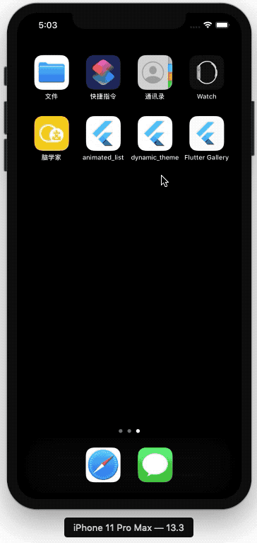

# Dynamic Theme

## 效果预览

<p align="center">
    
</p>


## Flutter version

```bash
Flutter 1.12.13+hotfix.9 • channel stable • https://github.com/flutter/flutter.git
Framework • revision f139b11009 (13 days ago) • 2020-03-30 13:57:30 -0700
Engine • revision af51afceb8
Tools • Dart 2.7.2
```

## 最佳实践

### 去掉`Android`溢出拖拽的半圆效果

```dart
class Behavior extends ScrollBehavior {
  @override
  Widget buildViewportChrome(
      BuildContext context, Widget child, AxisDirection axisDirection) {
    return child;
  }
}

ScrollConfiguration(
        behavior: CustomBehavior(),
        child: ListView.builder(
          itemCount: 60,
          itemBuilder: (BuildContext context, int index) {
            return Container(
              height: 44.0,
              width: MediaQuery.of(context).size.width,
              child: Center(child: Text('Data-$index')),
            );
          },
        ),
      )
```

### 是否是暗黑模式

```dart
final bool isDark = Theme.of(context).brightness == Brightness.dark;
```

### `helpers/colors.dart`自定义颜色

```dart
CustomColors.of(context).borderColor
```