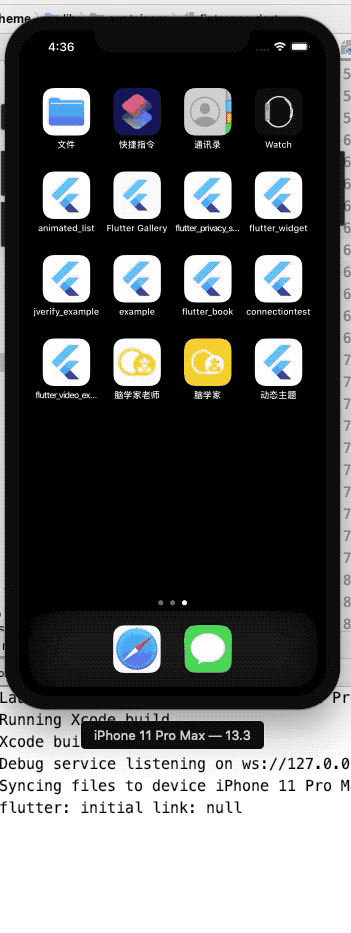
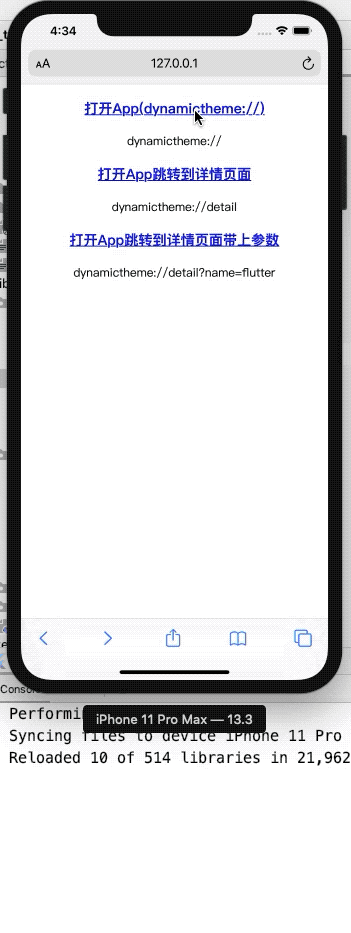
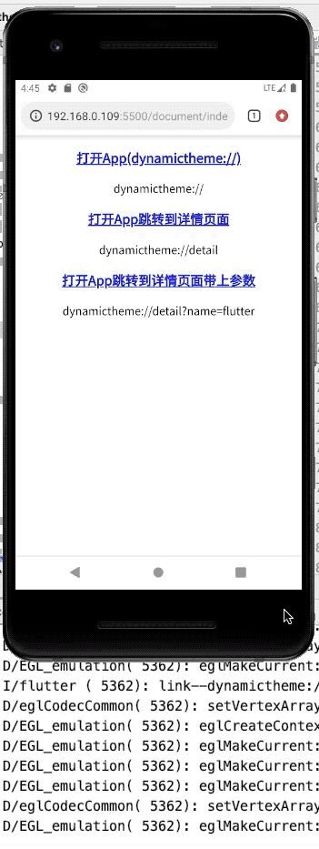
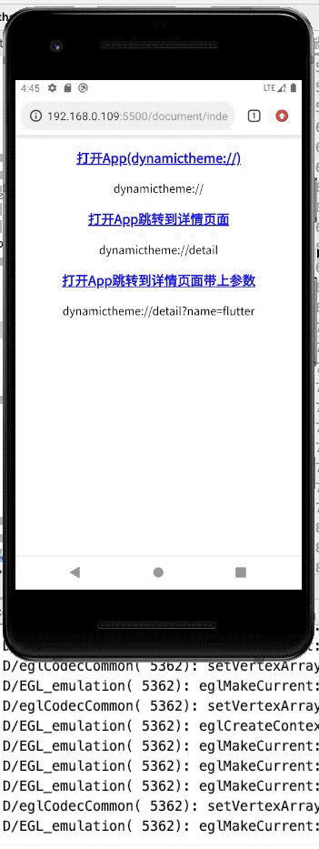

# Flutter scheme 使用

## URL scheme的作用

### iOS scheme介绍

我们都知道苹果手机中的APP都有一个沙盒，APP就是一个信息孤岛，相互是不可以进行通信的。但是iOS的APP可以注册自己的URL Scheme，URL Scheme是为方便app之间互相调用而设计的。我们可以通过系统的OpenURL来打开该app，并可以传递一些参数。

例如：你在Safari里输入www.alipay.com，就可以直接打开你的支付宝app，前提是你的手机装了支付宝。如果你没有装支付宝，应该显示的是支付宝下载界面，点击会跳到AppStore的支付宝下载界面。

URL Scheme必须能唯一标识一个APP，如果你设置的URL Scheme与别的APP的URL Scheme冲突时，你的APP不一定会被启动起来。因为当你的APP在安装的时候，系统里面已经注册了你的URL Scheme。

一般情况下，是会调用先安装的app。但是iOS的系统app的URL Scheme肯定是最高的。所以我们定义URL Scheme的时候，尽量避开系统app已经定义过的URL Scheme。

### Android scheme介绍

android中的scheme是一种页面内跳转协议;

通过定义自己的scheme协议，可以非常方便跳转app中的各个页面；

通过scheme协议，服务器可以定制化告诉App跳转到APP内部页面。

## 使用[uni_links](https://pub.dev/packages/uni_links#-installing-tab-)库

### 1 、`pubspec.yaml`文件新增依赖

```dart
dependencies:
  uni_links: 0.4.0
```
### 2 、安装

```dart
flutter pub get

Running "flutter pub get" in dynamic_theme...                       5.8s
Process finished with exit code 0
```

### 3、Dart代码中使用插件

```
import 'package:uni_links/uni_links.dart';
```

## Android 配置

**⚠️注意：Scheme 命名不支持`dynamic_theme`在`iOS`中测试了一下无法打开,改成了全小写`dynamictheme`**

### `android/app/src/main/AndroidManifest.xml`

**新增以下代码[查看完整代码]()**

```dart
<!-- Deep Links -->
<intent-filter>
    <action android:name="android.intent.action.VIEW" />
    <category android:name="android.intent.category.DEFAULT" />
    <category android:name="android.intent.category.BROWSABLE" />
    <!-- Accepts URIs that begin with YOUR_SCHEME://YOUR_HOST -->
    <data
          android:scheme="[YOUR_SCHEME]"
          android:host="[YOUR_HOST]" />
</intent-filter>
```

**例子：**

```dart
<intent-filter>
 <action android:name="android.intent.action.VIEW"/>
  <category android:name="android.intent.category.DEFAULT"/>
  <category android:name="android.intent.category.BROWSABLE"/>
  <data android:scheme="dynamictheme"/>
  <data 
        android:host="detail"
        android:scheme="dynamictheme"/>
</intent-filter>
```

## iOS 配置

### 打开`Xcode->Info->URL Types`设置`URL Scheme`

添加完也直接反应到配置文件`info.plist`中了，当然你要是觉得自己很厉害，也可以直接在`info.plist`添加。

<p align="center">
    Info->URL Types" src="../assets/preview/xcode_scheme.png">
</p>

**`ios/Runner/Info.plist`**

```dart
<?xml version="1.0" encoding="UTF-8"?>
<!DOCTYPE plist PUBLIC "-//Apple//DTD PLIST 1.0//EN" "http://www.apple.com/DTDs/PropertyList-1.0.dtd">
<plist version="1.0">
<dict>
...
<!-- 其它配置 -->
	<array>
		<dict>
			<key>CFBundleTypeRole</key>
			<string>Editor</string>
			<key>CFBundleURLSchemes</key>
			<array>
				<string>dynamictheme</string>
			</array>
		</dict>
	</array>
...
<!-- 其它配置 -->
</dict>
</plist>

```

## Dart 代码

**不同状态下实现页面跳转**

```dart
Future<void> initPlatformStateForStringUniLinks() async {
    String initialLink;
    // App未打开的状态在这个地方捕获scheme
    try {
      initialLink = await getInitialLink();
      print('initial link: $initialLink');
      if (initialLink != null) {
        print('initialLink--$initialLink');
        //  跳转到指定页面
        schemeJump(context, initialLink);
      }
    } on PlatformException {
      initialLink = 'Failed to get initial link.';
    } on FormatException {
      initialLink = 'Failed to parse the initial link as Uri.';
    }
    // App打开的状态监听scheme
    _sub = getLinksStream().listen((String link) {
      if (!mounted || link == null) return;
      print('link--$link');
    //  跳转到指定页面
      schemeJump(context, link);
    }, onError: (Object err) {
      if (!mounted) return;
    });
}
```

**解析Scheme跳转页面**

我配置的`scheme`是`dynamictheme://`使用的是`Deep Link`，你也可以配置成`http://www.xx.com`和`https://www.xx.com`这种是`App Links`。

```dart
final Uri _jumpUri = Uri.parse(schemeUrl.replaceFirst(
    'dynamictheme://',
    'http://path/',
  ));
  switch (_jumpUri.path) {
    case '/detail':
      Navigator.of(context).pushNamed(
        Detail.routeName,
        arguments: Detail(value: _jumpUri.queryParameters['name'] ?? '详情'),
      );
      break;
    default:
      break;
}
```

## Scheme [测试地址](https://tecode.github.io/dynamic_theme/document/index.html)

测试前需要先[安装APK](https://www.pgyer.com/QChJ)(目前只有安卓APK可以下载，iOS需要自己拉代码打包)。

```html
<a href="dynamictheme://"> 打开App(dynamictheme://) </a>
<a href="dynamictheme://detail"> 打开App跳转到详情页面 </a>
<a href="dynamictheme://detail?name=flutter"> 打开App跳转到详情页面带上参数 </a>
```


## iOS 效果预览

### 未打开App（开启以后跳转）

<p align="center">
    
</p>


### 已打开App（监听Scheme）

<p align="center">
    
</p>

## Android 效果预览

### 未打开App（开启以后跳转）

<p align="center">
    
</p>


### 已打开App（监听Scheme）

<p align="center">
    
</p>